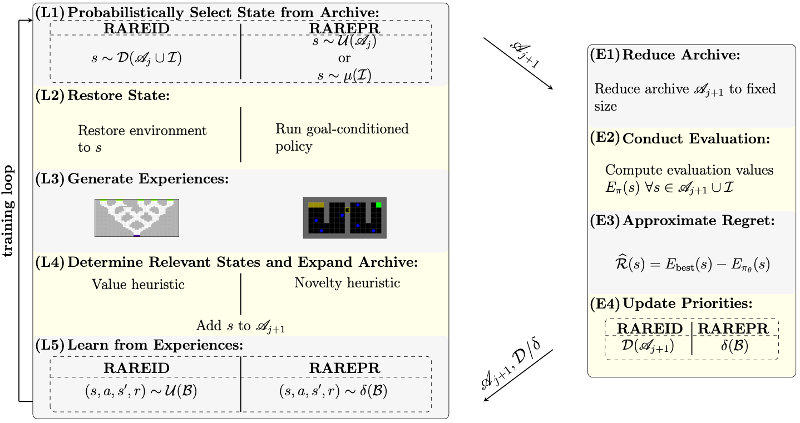

# Safe Reinforcement Learning Through Regret and State Restorations in Evaluation Stages.
### Timo P. Gros, Nicola Josef Müller, Daniel Höller, and Verena Wolf (2024).



# Documentation
This is the official implementation of the RARE algorithm from the paper ["Safe Reinforcement Learning Through Regret and State Restorations in Evaluation Stages"](http://fai.cs.uni-saarland.de/gros/papers/icaps24-RDDPS.pdf) by Timo P. Gros, Nicola Josef Müller, Daniel Höller, and Verena Wolf (2024).

## Python Environment

To set up the project and manage dependencies, please [use miniconda](https://docs.anaconda.com/free/miniconda/). Once miniconda is installed, navigate to the project root and run the following commands in your terminal:

```
conda env create -f environment.yml
conda activate safe_rl_with_rare
pip install -e .
```

## Training an Agent
This project uses so-called hermes files to run experiments. These files contain all the hyperparameter settings, and allow to easily specify which and how many agents you want to train.
To run an experiment, simply select a hermes file from [this](master/hermes_files) folder and run the following command from the [master](master) directory:
``` 
python3 train.py -f hermes_files/file.hermes -n results -ed /path/to/experiment/folder
```
Afterward, you can evaluate the trained agents using this command:
```
python3 evaluate_experiments.py -ed /path/to/experiment/folder -eb results
```


