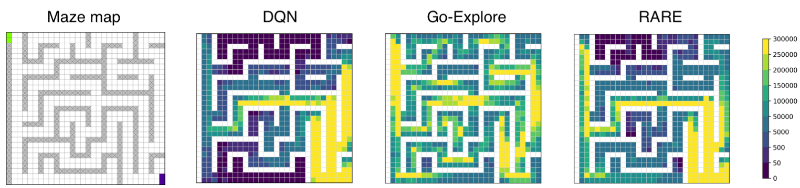

# Safe Reinforcement Learning Through Regret and State Restorations in Evaluation Stages.
### Timo P. Gros, Nicola Josef Müller, Daniel Höller, and Verena Wolf (2024).

This is the official implementation of the RARE algorithm from the paper ["Safe Reinforcement Learning Through Regret and State Restorations in Evaluation Stages"](http://fai.cs.uni-saarland.de/gros/papers/icaps24-RDDPS.pdf).


In a nutshell, RARE collects interesting states during training and evaluates the agent's room for improvement regarding safety.
Then, RARE focuses the agent's training on the states where safety can be improved the most. 

In the example figure below, you can see different agents trained on the Maze map of the Racetrack environment, where the goal is to drive from the purple cells to the green ones.



The heatmaps show how often each cell was visited during training. We make the following observations:
- The agent using the standard DQN algorithm struggles to reach the goal line. 
- The agent using Go-Explore, a popular exploration algorithm, explores the Maze uniformly, without focusing on the goal.
- The RARE agent balances exploration and exploitation, focusing on reaching the goal while exploring the areas where it is likely to crash.

We show on the popular Racetrack and MiniGrid benchmarks, that RARE can train agents that achieve fewer safety violations and higher returns than existing algorithms.


# Documentation

## Python Environment

To set up the project and manage dependencies, please [use miniconda](https://docs.anaconda.com/free/miniconda/). Once miniconda is installed, navigate to the project root and run the following commands in your terminal:

```
conda env create -f environment.yml
conda activate safe_rl_with_rare
pip install -e .
```

## Training an Agent
This project uses so-called hermes files to run experiments. These files contain all the hyperparameter settings, and allow to easily specify which and how many agents you want to train.
To run an experiment, simply select a hermes file from [this](master/hermes_files) folder and run the following command from the [master](master) directory:
``` 
python3 train.py -f hermes_files/file.hermes -n results -ed /path/to/experiment/folder
```
Afterward, you can evaluate the trained agents using this command:
```
python3 evaluate_experiments.py -ed /path/to/experiment/folder -eb results
```


